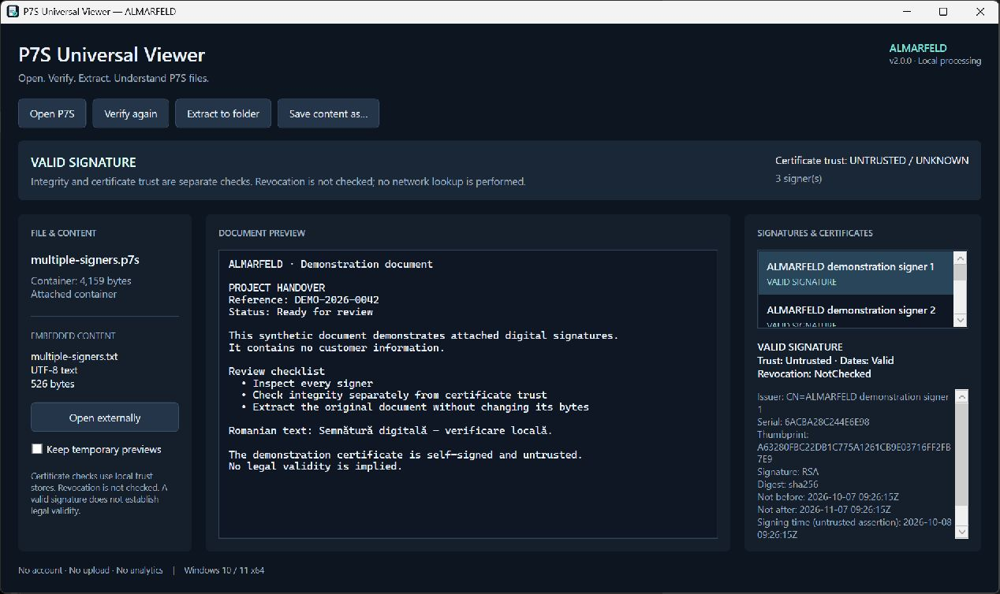
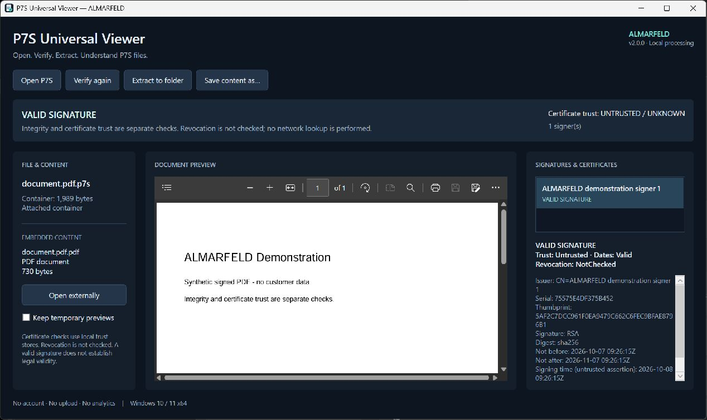
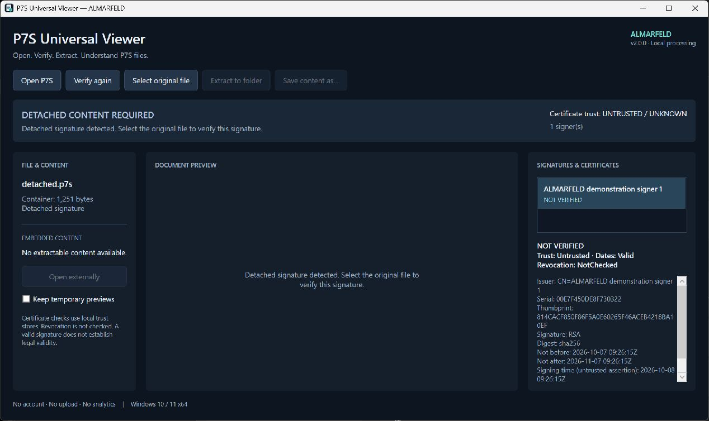
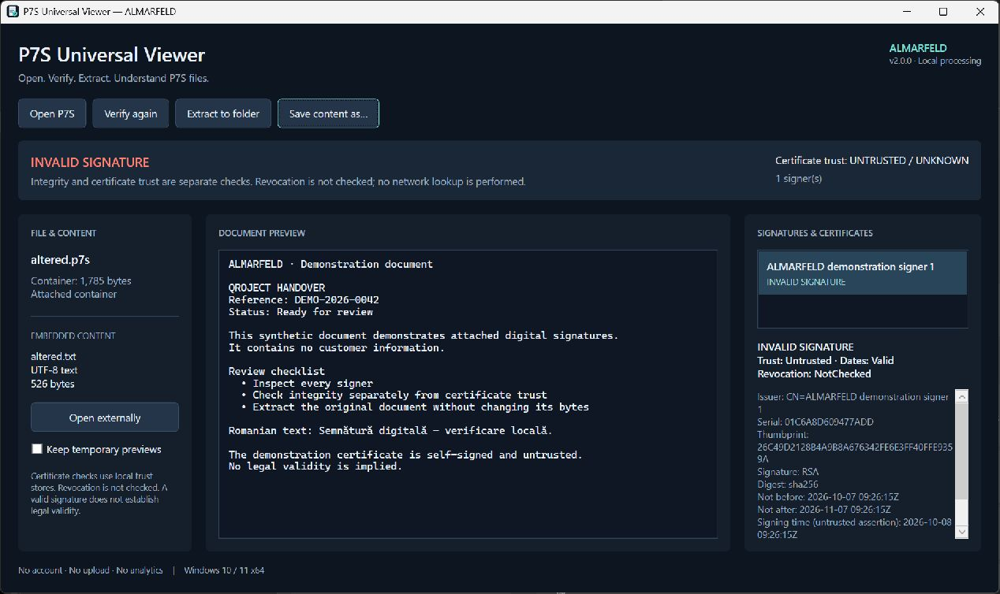

# P7S Universal Viewer

Open. Verify. Extract. Understand P7S files.

P7S Universal Viewer is a free, open-source Windows utility for opening CMS/PKCS#7 signed files, extracting embedded content, verifying cryptographic signatures and inspecting signer certificates. Files are processed locally.

## Release status

Version 2.0.0 is being prepared for review. It has not been published. [Existing releases](https://github.com/AlinTibi/p7s-universal-viewer/releases) remain available; the v1.0.0 installer is preserved unchanged. Its signature-list status can incorrectly display Valid for an altered payload; do not rely on that indicator.



### Real release-candidate screenshots

All examples use synthetic documents and demonstration certificates; no customer files or private paths are shown.






## What is a P7S file?

A P7S file usually contains a CMS/PKCS#7 signature. An attached signature includes the original document; a detached signature needs the exact original bytes supplied separately. This application supports both, with individual results for every signer.

## Verification and limitations

- **Integrity:** checks the cryptographic signature against the document bytes. Every status view uses the same typed result.
- **Trust:** separately builds the certificate chain using Windows trust stores and embedded certificates. Certificate downloads are disabled.
- **Dates:** reports current certificate validity separately from integrity and chain trust.
- **Revocation:** NOT CHECKED. The application does not contact CRL or OCSP endpoints. A certificate may have been revoked even when integrity passes.
- **Signing time:** a signed assertion, not proof from a trusted timestamp authority. Timestamp tokens are identified but not validated.
- A cryptographically valid signature does not establish legal validity, identity beyond the available certificate information, or safety of extracted content.

PDF, UTF-8 text, PNG, JPEG and GIF previews are supported. Other formats may be extracted and opened with another application; archives and Office containers are not decompressed. No executable payload is run automatically.

## Requirements and privacy

Windows 10 / 11 x64. Portable and installer packages include .NET 10; a separate .NET installation is unnecessary. PDF preview requires [Microsoft Edge WebView2 Runtime](https://developer.microsoft.com/microsoft-edge/webview2/). Missing WebView2 does not prevent inspection or extraction and is never installed automatically.

No account, file upload, analytics or telemetry. CMS processing and certificate checks are local, with no revocation network lookups. PDF preview blocks HTTP/HTTPS document requests. Opening extracted content externally is an explicit action; that application may use the network.

Input is limited to 64 MiB, extracted/original content to 48 MiB, signers to 32, certificates to 128, ASN.1 depth to 32 and items to 100,000. Text preview is limited to 512 KiB; image preview is limited to 40 megapixels. Extraction preserves original bytes. Existing files are never silently overwritten; choose another filename on collision.

Random preview sessions live under the user's local application data. They are cleaned on document changes and exit; abandoned owned sessions older than one day are cleaned on startup. The explicit Keep temporary previews preference retains those sessions. The WebView2 user-data directory is also under the user profile, not the install directory.

## Build and tests

Install .NET 10 SDK on Windows. Run:

```powershell
dotnet restore P7SUniversalViewer.slnx
dotnet build P7SUniversalViewer.slnx -c Release --no-restore
dotnet test P7SUniversalViewer.slnx -c Release --no-build
dotnet list P7SUniversalViewer.slnx package --vulnerable --include-transitive
pwsh ./scripts/package.ps1
```

Packaging also requires Inno Setup 6. Installer and portable EXEs are not Authenticode signed. Source commits and release tags use SSH signing; this is separate from Windows executable signing.

The v2 installer runs per user without administrator privileges. A historical machine-wide v1 installation can coexist with v2; it is not silently replaced. See [installation and migration](docs/INSTALLATION.md).

See [security reporting](SECURITY.md), [support](SUPPORT.md), [contributing](CONTRIBUTING.md), [changes](CHANGELOG.md) and [validation](docs/VALIDATION.md).

[ALMARFELD](https://almarfeld.com) is an independent software project. Existing [GitHub Pages URLs](https://alintibi.github.io/p7s-universal-viewer/) remain functional during migration.
